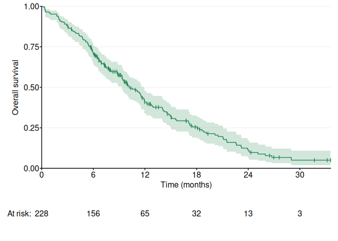
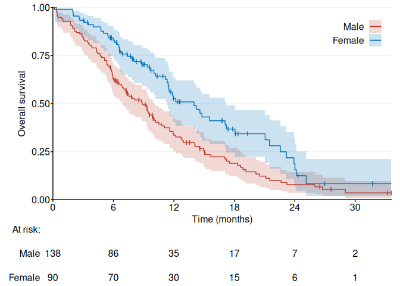
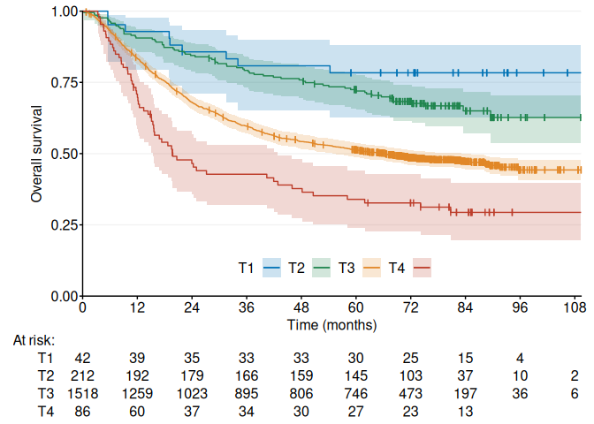
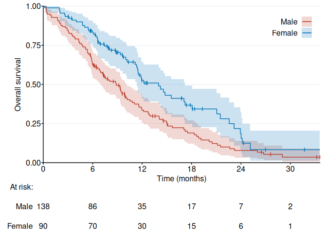

<!-- README.md is generated from README.Rmd. Please edit that file -->

# ggKaplanMeier

<!-- badges: start -->
<!-- badges: end -->

Kaplan–Meier plots using the `ggplot2` package, with an overall
Stata-like style. Differences compared to `survminer::ggsurvplot()`
include:

- Transparent pointwise confidence interval and simultaneous confidence
  band areas are always drawn behind survival curves and never over
  them.

- Censor marks are drawn as customizable line segments instead of point
  symbols.

- The risk table title is spaced uniformly with the risk table rows.

- The Kaplan–Meier y-axis title remains fixed in place, unaffected by
  the width of risk table labels.

## Installation

You can install the development version of ggKaplanMeier from
[GitHub](https://github.com/hongconsulting/ggKaplanMeier) with:

``` r
remotes::install_github("hongconsulting/ggKaplanMeier")
```

## Example: NCCTG lung cancer data

``` r
library(ggKaplanMeier)
data <- survival::lung
fig1a <- ggKM(data$time * 12 / 365.2425, data$status - 1, breaks.t = seq(0, 30, 6), colors = ggsci::pal_nejm()(4)[4], title.s = "Overall survival", title.t = "Time (months)")
print(fig1a)
```

<!-- -->

``` r
fig1b <- ggKM(data$time * 12 / 365.2425, data$status - 1, data$sex, breaks.t = seq(0, 30, 6), legend.labels = c("Male", "Female"), title.s = "Overall survival", title.t = "Time (months)")
print(fig1b)
```

<!-- -->

## Example: Dukes stage B/C colon cancer study

``` r
library(ggKaplanMeier)
data <- survival::colon
fig1 <- ggKM(data$time * 12 / 365.2425, data$status, data$extent, colors = ggsci::pal_nejm()(4)[c(2, 4, 3, 1)], legend.direction = "horizontal", legend.labels = c("T1", "T2", "T3", "T4"), legend.pos = c(0.5, 0.1), risk.table.margin = 20, title.s = "Overall survival", title.t = "Time (months)")
print(fig1)
```

<!-- -->

## Example: custom CI function

``` r
library(ggKaplanMeier)
data <- survival::lung
f.custom <- function() {
  fit <- survival::survfit(survival::Surv(.time, .status) ~ 1, 
                           conf.type = "plain")
  return(data.frame("time" = fit$time, "surv" = fit$surv, 
                    "lower" = fit$lower, "upper" = fit$upper))
}
fig1 <- ggKM(data$time * 12 / 365.2425, data$status - 1, data$sex, breaks.t = seq(0, 30, 6), legend.labels = c("Male", "Female"), title.s = "Overall survival", title.t = "Time (months)", CI = f.custom)
print(fig1)
```

<!-- -->

## Further Reading

1.  Dorey, F.J. and Korn, E.L., 1987. Effective sample sizes for
    confidence intervals for survival probabilities. *Statistics in
    Medicine*, 6(6), pp. 679–687.
2.  Fay, M.P., Brittain, E.H. and Proschan, M.A., 2013. Pointwise
    confidence intervals for a survival distribution with small samples
    or heavy censoring. *Biostatistics*, 14(4), pp. 723–736.
3.  Greenwood, M., 1926. A report on the natural duration of cancer. In:
    *Reports on Public Health and Medical Subjects*, 33, pp. 1–26.
    London: Her Majesty’s Stationery Office, Ministry of Health.
4.  Hollander, M. and McKeague, I.W., 1997. Likelihood ratio-based
    confidence bands for survival functions. *Journal of the American
    Statistical Association*, 92(437), pp. 215–226.
5.  Klein, J.P., Logan, B., Harhoff, M. and Andersen, P.K., 2007.
    Analyzing survival curves at a fixed point in time. *Statistics in
    Medicine*, 26(24), pp. 4505–4519.
6.  Nair, V.N., 1984. Confidence bands for survival functions with
    censored data: a comparative study. *Technometrics*, 26,
    pp. 265–275.
7.  Rothman, K.J., 1978. Estimation of confidence limits for the
    cumulative probability of survival in life table analysis. *Journal
    of Chronic Diseases*, 31(8), pp. 557–560.
8.  Thomas, D.R. and Grunkemeier, G.L., 1975. Confidence interval
    estimation of survival probabilities for censored data. *Journal of
    the American Statistical Association*, 70(352), pp. 865–871.
